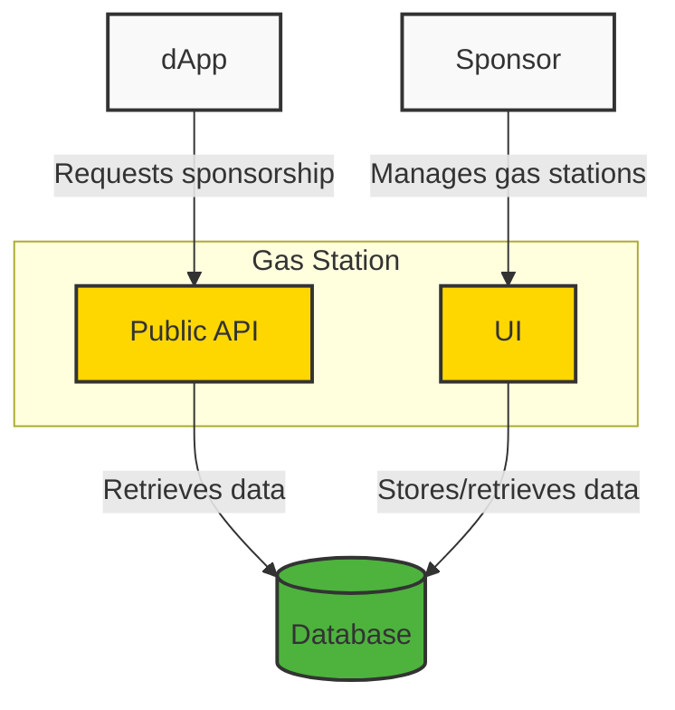

# Movement Gas Station

Movement Gas Station is a simple and efficient solution for transaction sponsorship on the Movement network. It allows dApp developers to easily cover gas fees for their users, enhancing user experience and reducing barriers to entry.

## Architecture Overview

## Advantages

- Streamlined sponsorship process for Movement network transactions
- Simple integration for dApp developers
- Flexible sponsorship conditions and policies
- User-friendly management interface for sponsors
- Fully open-source, accessible to everyone

This project aims to accelerate adoption of the Movement network by simplifying the gas fee experience for end-users.

## Getting Started

To get started, follow the [Getting Started Guide](./docs/getting-started).

## Features & Roadmap

- Sponsor Authentication

  - [x] Github
  - [ ] Google
  - [ ] Email

- Sponsor Condition

  - [x] Entry
  - [x] Module
  - [x] Address
  - [ ] Wildcard

- Supported Transaction

  - [x] simple transaction
  - [ ] multi-agent transaction
  - [ ] script

- Sponsor Policy

  - [ ] Transaction per user
  - [ ] Budget per user

> Note: We welcome your innovative ideas! If you have any suggestions or feature requests, please don't hesitate to open an [issue](https://github.com/kitelabs-io/mvmt-gas-station/issues)

## Contributing

Please see [CONTRIBUTING](./CONTRIBUTING.md)

## License

Please see [LICENSE](./LICENSE)
