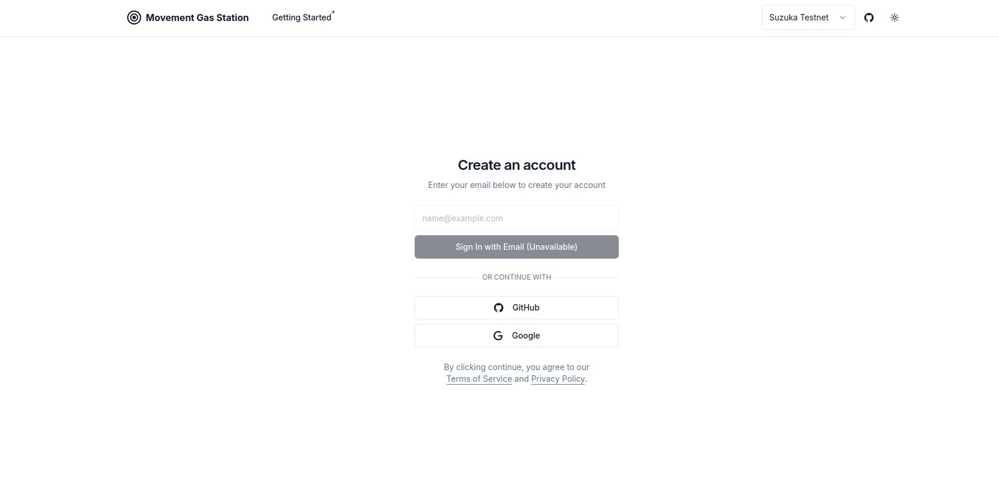
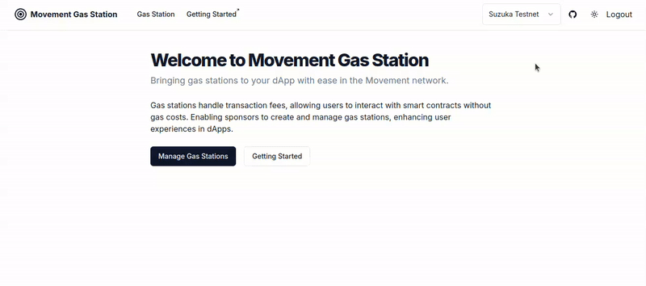
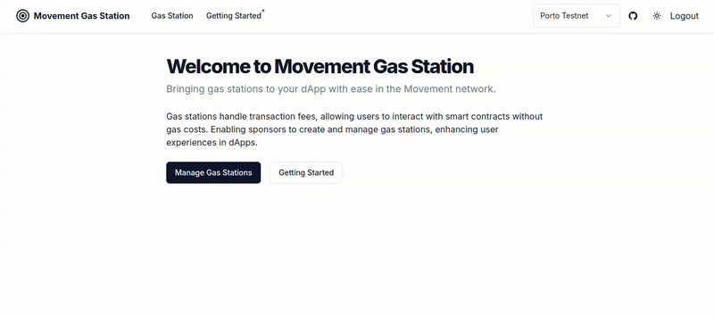
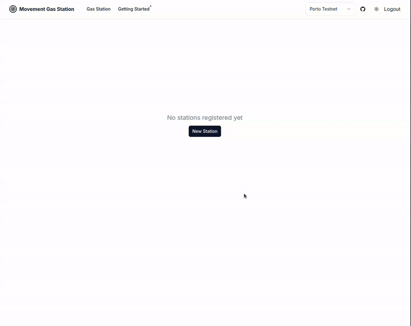

# Create a Gas Station

This guide will walk you through the process of creating a new gas station using the Gas Station interface.

## Steps to Create a Gas Station

- Authentication

To begin, you'll need to authenticate to access the Gas Station page.

- Select your network

- Visit Gas Station Page

Navigate to the `Gas Station` interface in the header bar.

- Register new gas station

**Note**: Before proceeding, transfer funds from your preferred wallet to the gas station's address. Your gas station requires these funds to successfully sponsor transactions for users.

[Next: Integrate with dApp](../integrate-with-dapp)
