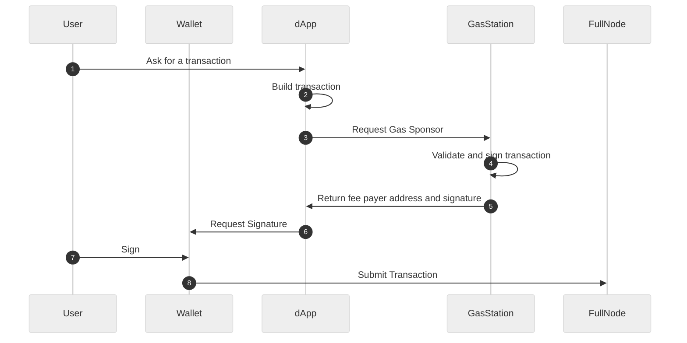

# Integrate with dApp

Now that we have a funded gas station, we can begin integrating it with a dApp. Let's start with a sequence diagram to see how it works.

## Build and Submitting transaction on Client



Summary:

- The user initiates a transaction request through the dApp.
- The dApp builds the transaction and requests sponsorship from the gas station.
- The gas station validates the transaction, signs it if it meets the required conditions, and returns the fee payer address and signature to the dApp.
- The dApp requests the user's signature through their wallet.
- The user signs the transaction using their wallet.
- The wallet submits the signed transaction to the full node for processing.

## Example

```ts
import {
	Account,
	AccountAddress,
	AccountAuthenticator,
	Aptos,
	AptosConfig,
	Deserializer,
	Network,
	Serializer,
} from "@aptos-labs/ts-sdk";

const { GAS_STATION_HOST, STATION_ID, CONTRACT_ADDRESS } = process.env;

class AuthenticatorDeserializer {
	auth: AccountAuthenticator;

	constructor(auth: AccountAuthenticator) {
		this.auth = auth;
	}

	static fromBase64(base64: string) {
		const buffer = Buffer.from(base64, "base64");
		const bytes = new Uint8Array(buffer);
		const deserializer = new Deserializer(bytes);

		const auth = AccountAuthenticator.deserialize(deserializer);

		return new AuthenticatorDeserializer(auth);
	}

	toBase64() {
		const serializer = new Serializer();

		this.auth.serialize(serializer);

		const bytes = serializer.toUint8Array();
		const base64 = Buffer.from(bytes).toString("base64");

		return base64;
	}
}

const aptosConfig = new AptosConfig({
	network: Network.TESTNET,
});

const aptos = new Aptos(aptosConfig);

// Generate an empty wallet and submit a transaction to post a message to a decentralized feed
const author = Account.generate();

const txn = await aptos.transaction.build.simple({
	sender: author.accountAddress,
	withFeePayer: true, // this flag must be set to enable fee sponsoring
	data: {
		function: `${CONTRACT_ADDRESS}::feed::write`,
		functionArguments: ["Hello world!"],
	},
});

// Call gas station to get fee payer signature
const { data } = await fetch(`${GAS_STATION_HOST}/api/v1/sponsor-tx`, {
	method: "POST",
	headers: {
		"Content-Type": "application/json",
	},
	body: JSON.stringify({
		txSimpleBase64: Buffer.from(txn.bcsToBytes()).toString("base64"),
		stationId: STATION_ID,
	}),
}).then((res) => res.json());

// fee payer address must be set as it contributes to transaction integrity
txn.feePayerAddress = AccountAddress.fromString(data.feePayerAddress);

const senderAuth = aptos.transaction.sign({
	signer: author,
	transaction: txn,
});

const feePayerAuth = AuthenticatorDeserializer.fromBase64(
	data.feePayerAuthenticator,
).auth;

const submitResult = await aptos.transaction.submit.simple({
	transaction: txn,
	senderAuthenticator: senderAuth,
	feePayerAuthenticator: feePayerAuth,
});

console.log({ submitResult });
```
